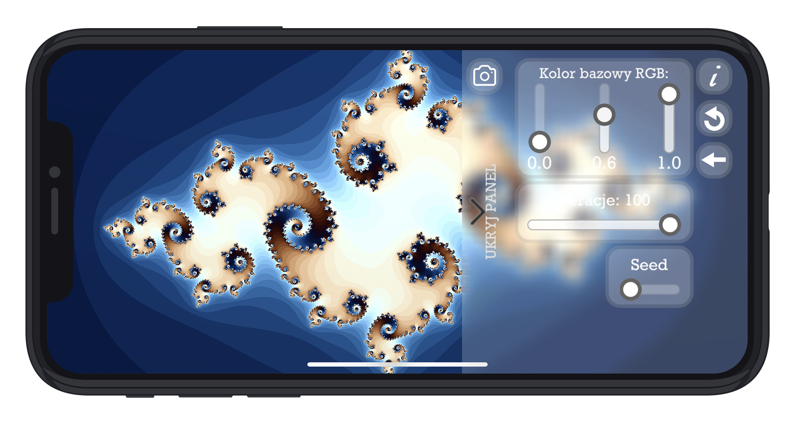
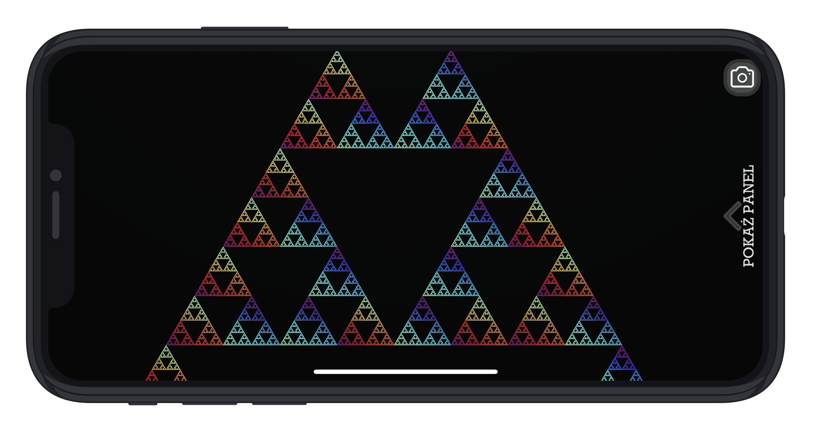
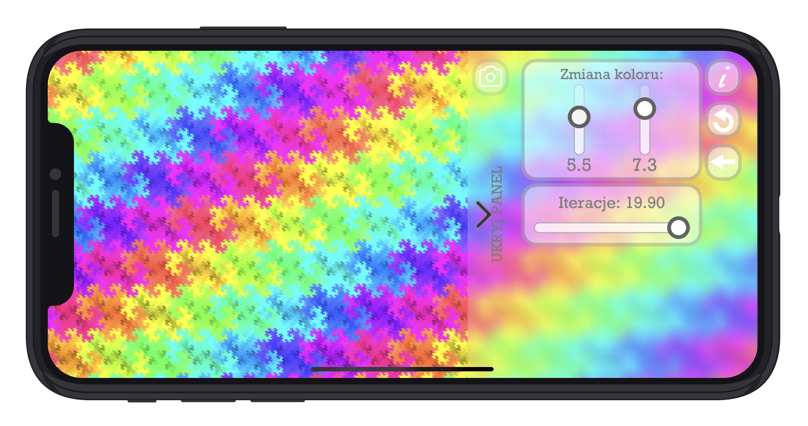

# Fraktale Mobilne

Aplikacja napisana w C# w środowisku Unity na system iOS, wyswietlająca wybrane fraktale oraz powalająca na manipulację nimi.

## Zawartość repozytorium

Projekt Unity: pliki shaderów oraz grafiki

## Działanie

Za pomocą menu, aplikacja pozwala na zmianę koloru i złożoności fraktali.

 

Na zachowanie obrazu pozwala wykorzystana biblioteka [NativeGallery](https://github.com/yasirkula/UnityNativeGallery).

